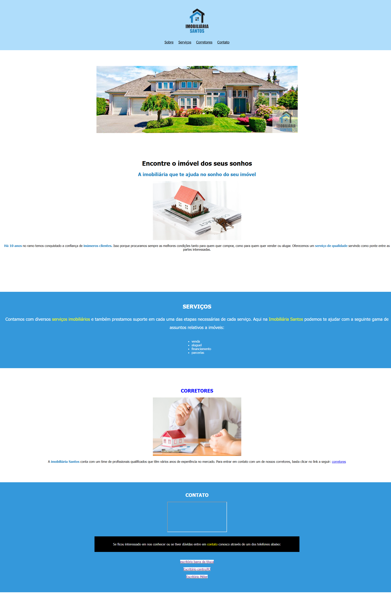

# Imobiliária Santos 🏠

Projeto de uma página web para uma imobiliária, desenvolvido para praticar HTML5 e CSS3.

## Sobre o projeto

Este projeto apresenta uma página institucional de uma imobiliária, contendo:

- Apresentação da empresa
- Serviços oferecidos
- Área dos corretores
- Formas de contato
- Localização através do Google Maps

## Tecnologias utilizadas

- HTML5
- CSS3

## Funcionalidades

✅ Navegação entre seções da página  
✅ Layout organizado em seções  
✅ Links internos usando âncoras HTML  
✅ Estilização personalizada com CSS

## Imagens do projeto

## Autor

Icaro Pietrele